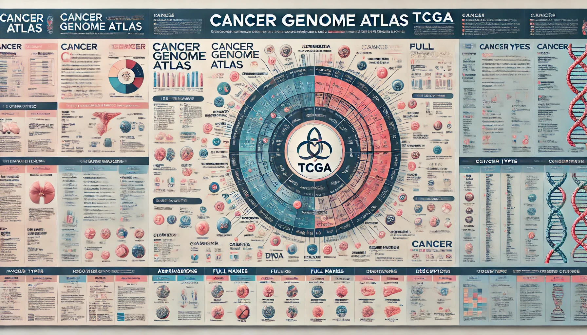
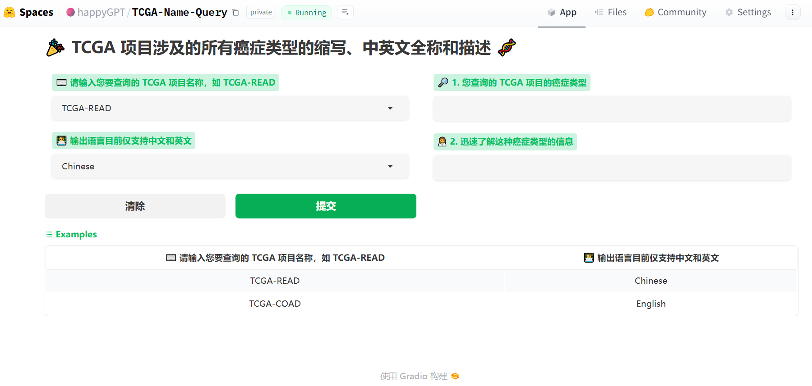

# 🚀 TCGA-Name-Query

🎉 TCGA 项目涉及的所有癌症类型的缩写、中英文全称和描述 🧬

Gradio app 在线网址：[https://huggingface.co/spaces/happyGPT/TCGA-Name-Query](https://huggingface.co/spaces/happyGPT/TCGA-Name-Query)

这个网页应用程序是专为查询和解释 TCGA（The Cancer Genome Atlas，即癌症基因组图谱）项目中癌症类型信息而设计的工具，它基于 Python 编程语言和 Gradio 框架构建。

**1. 标题**：应用的标题为 “TCGA 项目涉及的所有癌症类型的缩写、中英文全称和描述”。这明确展示了该工具的主要功能。

**2. 输入部分**：
- 有一个下拉菜单，用户可以在此选择想要查询的 TCGA 项目名称。提示文字说明为：“请输入您要查询的 TCGA 项目名称，例如 TCGA-READ。” 
- 语言选择：另一个下拉菜单供用户选择输出语言，目前支持的语言有中文和英文。图中显示，当前选择的是 “Chinese”（中文）。

**3. 操作按钮**：
- “清除“ 按钮：用于重置输入字段。
- “提交” 按钮：用于提交查询请求。

**4. 输出部分**：
- “1. 您查询的 TCGA 项目的癌症类型”：显示所选 TCGA 项目对应的癌症类型全称和对应的 TCGA 官方网页链接。
- ”2. 迅速了解这种癌症类型的信息”：提供关于该癌症类型的详细描述和相关信息。

**5. 示例部分**：
- 在界面底部有一个 "Examples"（示例）区域，展示了如何使用该工具的例子，这些示例能帮助用户掌握应用程序的正确使用方法。
- TCGA-READ 和 Chinese（中文）
- TCGA-COAD 和 English（英文）

这款应用程序专为帮助用户快速检索 TCGA（癌症基因组图谱）项目中特定癌症类型的信息而设计。用户可以选择感兴趣的 TCGA 项目缩写，并指定输出语言——中文或英文。之后，程序将提供该癌症类型的完整名称及其详尽描述。对于研究人员、医疗专业人士以及对癌症基因组学有兴趣的爱好者来说，此工具提供了极大的便利性和实用性，能够有效地支持他们的工作和研究需求。
